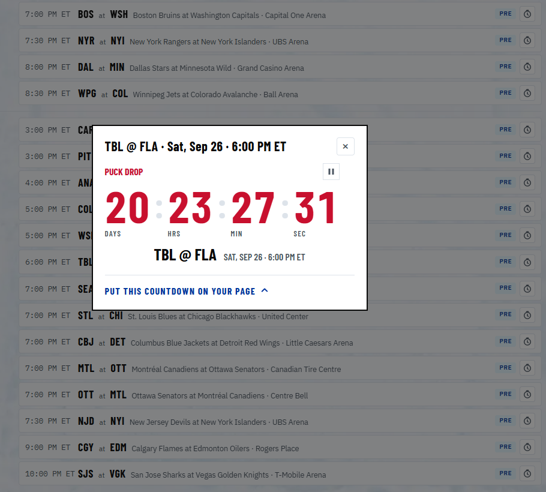
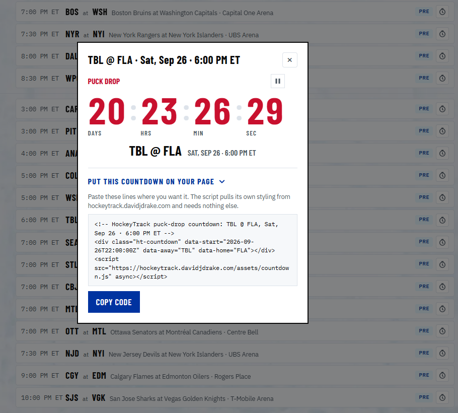

# HockeyTrack

A serverless NHL game-data ingestion pipeline on AWS. It watches the league schedule, wakes up for every game, polls the NHL's public API every few seconds while the puck is in play, archives every raw response to S3, and publishes each play as a discrete event on an EventBridge bus — so anything you want to build on live hockey data is one EventBridge rule away.

## What it does

- **Archives everything, raw.** Play-by-play and boxscore snapshots land in S3 whenever they change during a game, plus a full end-of-game sweep (play-by-play, boxscore, landing summary, shift charts). Nothing is parsed away; every future use case has the original JSON.
- **Publishes events in near-real-time.** Every new play (goals, shots, hits, penalties, faceoffs…), every game-state change, and a final summary event go onto a custom EventBridge bus within seconds of the NHL API reflecting them.
- **Runs only when hockey is on.** A daily job walks the entire published season and keeps a one-time EventBridge Scheduler entry per game — every game is armed as soon as the league announces it, and reschedules are reconciled each morning. No games, no compute.

## Architecture

<p align="center">
  
</p>

One Go binary, shipped as a single container image, runs in three modes selected by a `MODE` env var:

| Mode | Trigger | Job |
|---|---|---|
| `schedule-sync` | daily cron | Pull the full published season (following the API's week-to-week links), record games in DynamoDB, create/move/delete per-game Scheduler entries (handles reschedules and postponements); then archive the day's league standings and publish both site documents |
| `poller` | per-game Scheduler entry | Poll play-by-play + boxscore every 5s, diff against a DynamoDB high-water mark, publish new events, snapshot changed JSON to S3; near the 15-minute Lambda limit it re-invokes itself and hands off (a DynamoDB lease guarantees exactly one active chain per game); at game end it runs the archive sweep |
| `sweeper` | 5-minute rate rule | Restart any poller chain that died mid-game, detected via expired leases |

The poll loop itself is runtime-agnostic — Lambda's 15-minute ceiling is handled by an injected `shouldHandOff()` callback. Point the same container at ECS/Fargate with a callback that always returns false and it simply polls a whole game in one run. That migration is a new thin entrypoint, not a rewrite.

## The website

**[hockeytrack.davidjdrake.com](https://hockeytrack.davidjdrake.com)** shows the whole season — every game, with **multi-select filters for teams and months** (pick any combination of clubs to see every game involving them, and any set of months; selections show as removable chips and persist between visits), a preseason/regular-season toggle, and free-text search. Selecting a single team switches to that club's season view: game number 1–84, home/away, rest days, and back-to-backs. **[/standings/](https://hockeytrack.davidjdrake.com/standings/)** is the league table by conference and division — W-L-OTL, points, goals for and against, and streaks — in the NHL's own order, so tiebreakers are the league's rather than ours; clubs picked on the schedule page are highlighted.

Every game on the schedule has a stopwatch button that opens a **puck-drop countdown** for that game, and the popup includes the two-line snippet to put that countdown on your own page:

```html
<div class="ht-countdown" data-start="2026-10-01T23:30:00Z" data-away="TBL" data-home="NYR"></div>
<script src="https://hockeytrack.davidjdrake.com/assets/countdown.js" async></script>
```

The script (`site/assets/countdown.js`, ~9 KB, no dependencies) mounts a clock into every `.ht-countdown` element, loads its own stylesheet, and needs nothing else; the same component drives the home-page tile. It reads the visitor's clock, so it needs no server. Add `data-credit="off"` to drop the "Countdown by" line.

<p align="center">
  
  
</p>

It is a static site on S3 behind CloudFront. The documents it renders are `data/schedule.json` and `data/standings.json`, which `schedule-sync` republishes every morning (the standings are a trimmed copy of `api-web.nhle.com/v1/standings/now`, whose raw response is also archived under `raw/standings/{date}.json`), so the pages stay current with reschedules and results without any manual step. Off-season, the NHL serves the previous season's final table until the first game is played, and the page labels it by that season. The pages live in `site/` and are uploaded with `make site`; the infrastructure (bucket, distribution, certificate, DNS) is `terraform/site.tf`.

## The event contract

Bus `hockeytrack`, source `hockeytrack.poller`. Three detail-types (plus `hockeytrack.alert` for operational alerts):

- **`nhl.game.play`** — one event per play. Detail includes `schemaVersion`, `gameId`, `seq`, `playType` (`goal`, `shot-on-goal`, `penalty`, `faceoff`, `hit`, …), team abbreviations, `scoringTeam` (goals only), period/clock, the running score, and the full untouched NHL play object under `raw`.
- **`nhl.game.status`** — game-state transitions (pregame → live → final) with score.
- **`nhl.game.final`** — emitted once after the archive sweep, with the final score and the game's S3 prefix.

Delivery is at-least-once; consumers should dedupe on `(gameId, seq)`. Every event carries `schemaVersion` so the schema can evolve without breaking you.

**`raw` is untrusted input.** It is third-party JSON from the NHL API passed through verbatim — HockeyTrack does not validate, sanitize, or bound it. Treat it as you would any external payload: validate the fields you use, escape it before rendering it in HTML/SMS/email, never `eval` or template it unescaped, and don't assume its shape is stable. The typed top-level fields (`playType`, `scoringTeam`, score, period/clock) are parsed by the poller and are safer to match rules on, but their string values still originate from the same source.

## Extending it

The pipeline never needs to change for new consumers — subscribe with an EventBridge rule and point it at any target (Lambda, SNS, SQS, Step Functions, API destinations…).

**"Text me every Lightning goal":**

```json
{
  "source": ["hockeytrack.poller"],
  "detail-type": ["nhl.game.play"],
  "detail": { "playType": ["goal"], "scoringTeam": ["TBL"] }
}
```
→ target an SNS topic with an SMS/email subscription. That's the whole feature.

`terraform/notifications.tf` ships exactly that, generalised: `team_alerts` is a map keyed by team abbreviation, and each entry gets its own SNS topic, email subscription, and one EventBridge rule per alert type it opts into. Goals are on by default; puck drop, final score, and overtime/shootout are opt-in booleans:

```hcl
team_alerts = {
  TBL = { email = "you@example.com", name = "Lightning", game_start = true, final = true, overtime = true }
  BOS = { email = "" } # topic and goal rule only; no subscription
}
```

Each rule uses an input transformer to turn the event into a one-line message (e.g. `GOAL Lightning! BOS @ TBL — TBL now has 2, period 2 at 08:41.`). The `nhl.game.status` event carries no team names, so the puck-drop rule matches on the presence of the team's key in `score`; the overtime rule matches `period-start` plays with `period > 3` on the typed contract and pulls the OT/SO label from `raw.periodDescriptor.periodType`. A "playing tonight" morning digest is deliberately not here: it needs `schedule-sync` to publish something a rule can match on, which is a code change rather than a rule.

**Other natural extensions:**

- **Post-game analytics** — rule on `nhl.game.final`, trigger a Lambda/Glue job that reads the game's S3 prefix (the event hands it to you).
- **Live dashboards** — rule on `nhl.game.play` → WebSocket pushes via API Gateway.
- **Historical backfill** — the `internal/nhl` client fetches any past game; a batch job reusing it can fill S3 with prior seasons.
- **Ad-hoc queries over the archive** — the S3 layout (`raw/{season}/{date}/{gameId}/{feed}/…`) partitions cleanly for Athena.
- **Fargate migration** — see above; the container is already ECS-ready.

## Deploying

Prereqs: AWS credentials, Terraform ≥ 1.10 (the S3 backend uses native `use_lockfile` state locking; there is no DynamoDB lock table), Docker, Go 1.23+.

```bash
# one-time: create terraform/terraform.tfvars (gitignored) with your email variables,
# then create the ECR repo first so the image push has a home
cd terraform && terraform init && terraform apply -target=aws_ecr_repository.main -var="image_tag=bootstrap"

# then every deploy: test → build → push image (tagged with the git SHA) → terraform apply
make deploy
```

**Check your Lambda concurrency quota before the season.** New AWS accounts often start with a *Concurrent executions* limit of 10 in each region rather than the documented default of 1,000. HockeyTrack runs one poller per live game, and busy NHL nights have 10–13 games at once, plus the sweeper and daily sync — at 10 the pollers will throttle and games will be missed. Check with:

```bash
aws lambda get-account-settings --region us-east-1 --query AccountLimit.ConcurrentExecutions
```

If it says 10, request an increase: Service Quotas → AWS Lambda → *Concurrent executions* (quota code `L-B99A9384`) → *Request increase at account level*. The console will not accept a value below 1,000, which is fine — it is a ceiling, not a charge. Approval usually takes minutes to a day. Or from the CLI:

```bash
aws service-quotas request-service-quota-increase --service-code lambda --quota-code L-B99A9384 --desired-value 1000 --region us-east-1
```

This is also why `terraform/lambda.tf` sets no reserved concurrency on the poller: AWS requires 10 unreserved executions account-wide, so there is nothing to reserve until the quota is raised.

Variables: `region` (default `us-east-1`), `image_tag` (set by `make deploy`), and two **required** notification variables that have no default on purpose: `alert_email` (subscribes you to CloudWatch alarms for DLQ depth — the three Lambda DLQs and the DLQ behind the ECR scan-findings EventBridge target — poller errors, and a silent sweeper (no invocations for 30 minutes, which means EventBridge Scheduler is not invoking Lambdas at all), and to ECR scan results with CRITICAL/HIGH findings) and `team_alerts` (the per-team alert rules in `terraform/notifications.tf`, see [Extending it](#extending-it)). Set `alert_email` to `""`, or a team's `email` to `""`, to opt out of that subscription; `team_alerts = {}` removes the team resources entirely. Put them in a gitignored `terraform/terraform.tfvars`, which Terraform loads automatically so `make deploy` carries them every time:

```hcl
alert_email = "you@example.com"
team_alerts = {
  TBL = { email = "you@example.com", name = "Lightning" }
}
```

They are required rather than defaulting to empty because a plan run from a checkout without the tfvars file would otherwise *silently* plan to destroy the existing email subscriptions; with no default, Terraform refuses to plan until the values are supplied.

**Migrating from `lightning_email`** (pre-HOC-43): replace `lightning_email = "..."` in `terraform.tfvars` with the `team_alerts` block above, carrying the same address (or `email = ""` if it was empty). `moved` blocks in `notifications.tf` carry the existing TBL topic, rule, target, and confirmed email subscription over to the new addresses, so the plan should show updates in place (new message text, topic policy) and no destroy/create; a plan that wants to replace `aws_sns_topic_subscription.team_email["TBL"]` means the migration went wrong and would require re-confirming the subscription email.

**Logging and WAF.** CloudFront standard logging for the website is deliberately not enabled: the site is static, has no authentication or user data, and an access log bucket adds S3 cost and another data store to manage for little investigative value at this scale. AWS WAF is likewise not warranted for a static site of this size. Both can be added later in `terraform/site.tf` (a private log bucket plus the distribution's `logging_config` block; a WAF web ACL attached via `web_acl_id`) if abuse or traffic patterns ever justify them. The Lambdas do log to CloudWatch, and each function's role may write only to its own `/aws/lambda/<function>` log group.

Cost is dominated by poller runtime: roughly **$0.05/game**, on the order of **$10–15/month in season** and near-zero in the off-season. S3/DynamoDB/EventBridge usage is pennies at this volume.

## Development

- `make test` / `go test ./...` — unit tests use real captured NHL API responses as fixtures (never hand-written), with golden tests on the play-by-play diff logic: given snapshot N and N+1, exactly these events are emitted. `make test` first runs `make vuln` (govulncheck), so a known reachable vulnerability fails the build.
- **Supply chain** — every image pushed to ECR is scanned on push; the `Dockerfile` pins both base images by digest (bump instructions are in its header comment). ECR keeps only the 20 most recently pushed tagged images (`ecr_keep_images` in `terraform/variables.tf`) and drops untagged ones after a day, so superseded release tags stop accumulating. Tags are immutable and every deploy pushes a fresh git-SHA tag, so the image the Lambdas run is always among the newest and never ages out.
- **Replay harness** — run a full recorded game through the real poller path against in-memory fakes, printing every event it would publish:

  ```bash
  go run ./cmd/replay -game path/to/snapshots/
  ```

  This is the primary end-to-end check when no live games are on.
- **Analyzing the archive** — `cmd/analyze` flattens archived games' `final/pbp.json` and `final/shifts.json` into three CSV tables for pandas, DuckDB, a spreadsheet, or whatever you like: `games.csv` (one row per game: ids, date, season, teams, final score, period count, shots per team), `plays.csv` (one row per play: sequence, period and clock, type, team, coordinates and every player id the play names), and `shifts.csv` (one row per shift from the shift chart, with the duration in seconds). It reads straight from the raw bucket or from a local mirror of it:

  ```bash
  go run ./cmd/analyze -bucket $(cd terraform && terraform output -raw raw_bucket) -season 20252026 -out ./csv
  aws s3 sync s3://<raw bucket>/raw ./mirror/raw && go run ./cmd/analyze -dir ./mirror -out ./csv
  ```

  Flags: `-bucket` (or `$RAW_BUCKET`) *or* `-dir`; `-out` directory (default `.`); `-season` and `-date` (YYYY-MM-DD, needs `-season`) to narrow the run, which for S3 also narrows the listing (without `-season` it lists the whole bucket, live snapshots included, so for full history prefer the sync). Only `pbp.json` is required per game and it supplies the whole game row — `landing.json` and `boxscore.json` are not read; what an era lacks comes out blank (no shift charts before 2010-11, no coordinates or shot totals in the earliest seasons — see the table under "Backfilling history"). Goal markers in the shift chart (`typeCode` 505) are dropped, since they duplicate `plays.csv`. A game whose `pbp.json` is malformed is logged and skipped, and the run exits 1; a field of an unexpected type, or a shift chart that cannot be read, costs only that cell or that game's shift rows.
- AWS is always behind interfaces (`internal/store`, `internal/events`); logic tests run against fakes, no AWS or localstack required.
- **Link previews** — `make og` re-renders the home page's Open Graph card (`site/assets/og/home.png`) from `docs/og/home.html` with the puck-drop countdown as of that moment. The ice photo is by Compagnons on Unsplash (Unsplash License).

### Backfilling history

The pipeline is forward-only, but the NHL API serves every game back to the league's first on 19 December 1917. `cmd/backfill` walks a past season's schedule week by week and writes the same `final/` objects the poller leaves behind (play-by-play, boxscore, landing, and shift charts from 2010-11 onward) for every finished game. It touches only S3: no events are published, so a historical Lightning goal never trips a notification rule, and nothing is written to DynamoDB or the scheduler.

```bash
make backfill                     # every season the API lists, newest first
make backfill SEASONS=20252026    # one season
make backfill SEASONS=19171918-19421943
```

Runs are resumable and idempotent: objects already in the bucket are skipped, so an interrupted run (or one with transient failures) is just rerun. Requests are paced at 3/s by default (`RPS=`). What you get depends on the era:

| Seasons | Play-by-play | Shift charts |
|---|---|---|
| 2010-11 onward | Full, with coordinates | Yes |
| 2009-10 | Full, with coordinates | No |
| 2006-07 to 2008-09 | Goals, shots, penalties | No |
| 1917-18 to 2005-06 | Goals and penalties | No |

The whole history is roughly 70,000 games, 235,000 requests, and 20 GB, which is about a day of wall time at the default pace and under $0.50/month to keep.

```
cmd/ingestor/     entrypoint; MODE selects schedule-sync | poller | sweeper
cmd/backfill/     historical season backfill (local CLI, S3 only)
cmd/replay/       offline replay harness
cmd/analyze/      archive → CSV flattener (local CLI, reads S3 or a local mirror)
site/             the website (static pages; data/*.json published by schedule-sync)
internal/nhl/     NHL API client + captured fixtures
internal/analyze/ final/ feeds → games/plays/shifts tables
internal/poller/  diff logic + the runtime-agnostic poll loop
internal/backfill/  season walk + final-feed fetch with pacing, retry, resume
internal/schedsync/  schedule pull + Scheduler reconciliation
internal/sweeper/ dead-chain detection and restart
internal/store/   DynamoDB game store (leases, high-water marks) + S3 archive
internal/events/  versioned event types + EventBridge publisher
terraform/        the whole stack: ECR, Lambdas, DynamoDB, S3, bus, scheduler, IAM, DLQs, alarms
docs/superpowers/ design spec and implementation plan
```

## Caveats

- The NHL API (`api-web.nhle.com`) is **unofficial and undocumented**. It's free, keyless, and widely used by community projects, but the NHL could change or restrict it at any time. The client isolates all API knowledge in `internal/nhl`, and the raw archive means a format change never costs you already-captured data.
- This project is not affiliated with or endorsed by the NHL. Data belongs to its respective owners; use responsibly.

## License

[MIT](LICENSE) — use it, fork it, build your own alerts on it.
